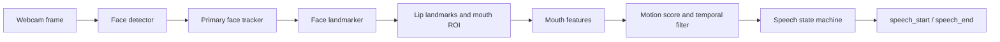

# Visual Voice Activity Detection

Visual Voice Activity Detection (VvAD) detects probable speech activity from webcam video. It follows one face, measures lip movement over time, and emits `speech_start` and `speech_end` events.

This project is visual-only. It does not read microphone audio or perform speech recognition.

## Running it

Create and activate a virtual environment once:

```powershell
python -m venv .venv
.\.venv\Scripts\Activate.ps1
pip install -e .
```

Start the full demo:

```powershell
python -m visual_vad --config config.example.yaml --visualize
```

That command opens the webcam view and the 96 x 96 mouth ROI view. It also writes `speech_start` and `speech_end` events to the terminal. Press `q` or `Esc` in the webcam window to exit.

To use another webcam:

```powershell
python -m visual_vad --config config.example.yaml --visualize --camera 1
```

For event processing without OpenCV windows, omit `--visualize`.

## What happens to a frame



OpenCV owns camera access, image resizing, cropping, and the demo windows. MediaPipe provides the pre-trained face detector and face landmark model. The rest of the pipeline is regular Python and NumPy.

The headless API uses bounded `asyncio.Queue` instances:

```text
camera -> frames -> feature extraction -> features -> speech scoring -> events
```

The MediaPipe models are created once when `VisualVAD` starts and remain available for the lifetime of the pipeline.

## Using it from another application

```python
import asyncio

from visual_vad import VisualVAD
from visual_vad.config import load_config


async def main() -> None:
    vad = VisualVAD(load_config("config.example.yaml"))
    async for event in vad.detect():
        print(event.event_type, event.confidence)


asyncio.run(main())
```

`SpeechEvent` is the integration boundary. A WebSocket, WebRTC, HTTP, or application adapter can consume these events without depending on the OpenCV demo.

## Configuration

The default profile is [config.example.yaml](config.example.yaml). The values below are the main speech controls:

```yaml
speech:
  filter:
    strategy: exponential_moving_average
    window_size: 5
    ema_alpha: 0.30
  state_machine:
    start_confidence: 0.45
    end_confidence: 0.24
    start_hold_seconds: 0.25
    end_hold_seconds: 2.00
    minimum_talking_seconds: 1.00
```

The system starts only after the score stays above `start_confidence` for `start_hold_seconds`. Once talking, it ends only after the score stays below `end_confidence` for `end_hold_seconds`. The two thresholds are intentionally different; this avoids frequent start/stop events around a single boundary.

If it ends too early, increase `end_hold_seconds`. If it does not start, lower `start_confidence` in small steps. Keep `end_confidence` below `start_confidence`.

On Windows, the default camera backend is DirectShow. If the camera fails to start, use `auto` or `mediafoundation` under `pipeline.camera.backend`.

## Layout

```text
assets/       MediaPipe model files
detector/     camera, face detection/tracking, mesh, ROI, features
models/       data objects shared by pipeline components
utils/        drawing, FPS, logging, common configuration
visual_vad/   public API, async engine, filters, speech scoring, events
examples/     minimal package usage example
tests/        unit tests
docs/         design and development notes
```

## Checking a change

```powershell
python -m unittest discover -s tests -v
python -m visual_vad --config config.example.yaml --visualize
```

During the manual run, check that the face box and mouth ROI follow the intended person, the on-screen score changes with lip movement, and one speech segment produces one start event and one end event.

## Notes

This is not a replacement for audio VAD or speech recognition. Results depend on camera quality, lighting, head pose, occlusion, and non-speech mouth movement. The current detector is rule-based and designed to be tuned from configuration. A learned temporal model is the next step if the rule-based approach is not accurate enough for the target environment.

More detail is available in [docs/](docs/), including the [architecture](docs/architecture.md), [pipeline](docs/pipeline.md), [API](docs/api.md), and [configuration notes](docs/configuration.md).
